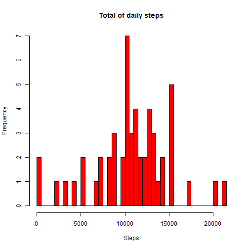
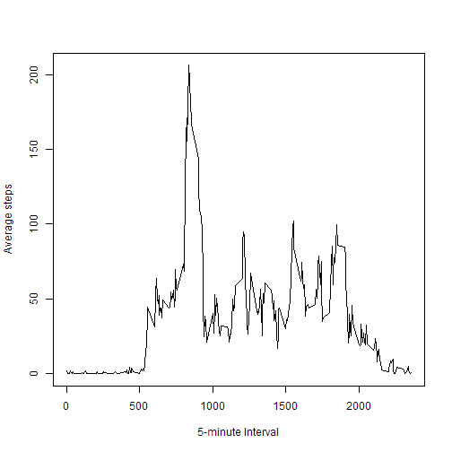
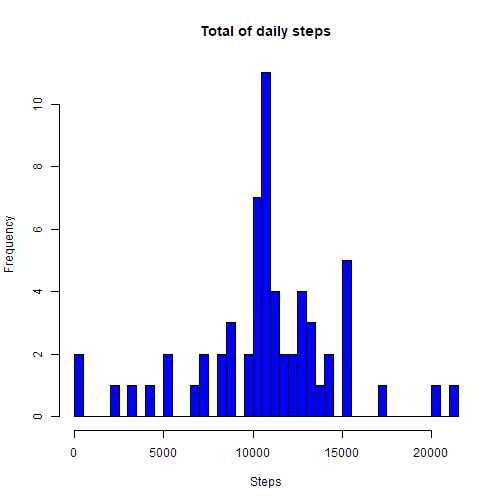
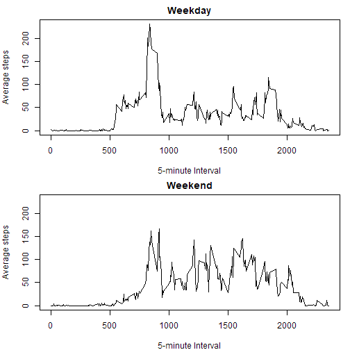

First, setting the global option echo to TRUE, as required

```r
knitr::opts_chunk$set(echo = TRUE)
```

## Loading and preprocessing the data

```r
download.file("https://d396qusza40orc.cloudfront.net/repdata%2Fdata%2Factivity.zip","archive.zip")
unzip("archive.zip")
activity<-read.csv("activity.csv")
```


## What is mean total number of steps taken per day?
First, we aggregate the data to sum the steps per day

```r
dailySteps<-aggregate(steps~date,activity,sum,na.action=na.omit)
```

Then, we plot the histogram. We want a bar for each day, 

```r
hist(dailySteps$steps,breaks=nrow(dailySteps),main="Total of daily steps",xlab="Steps",col="red")
```



Finally, we calculate and report the mean and median of the total number of steps taken per day. The numbers are rounded so thay can be read more easily. We have to use the as.character() function because the display of the number is off when knitting.


```r
totalMean <- as.character(round(mean(dailySteps$steps),digits=0))
totalMedian <- as.character(round(median(dailySteps$steps),digits=0))
```

Mean: 10766  
Median: 10765


## What is the average daily activity pattern?


```r
intervalAvg <- aggregate(steps~interval,activity,mean,na.action=na.omit)
plot(intervalAvg$interval,intervalAvg$steps,type="l",xlab = "5-minute Interval",ylab = "Average steps" )
```



Which 5-minute interval, on average across all the days in the dataset, contains the maximum number of steps?

```r
maxInterval <- intervalAvg[intervalAvg$steps==max(intervalAvg$steps,na.rm = TRUE),1]
```
The interval containing on average the maximum number of steps is : 835  

## Imputing missing values


```r
NARows<- sum(is.na(activity$steps))
```
Number of NA rows: 2304

Imputing strategy: we will replace the NA values with the average (mean) for that interval. 

```r
activityImpute<-activity
activityImpute$steps[is.na(activity$steps)]<-intervalAvg$steps[match(intervalAvg$interval,activity$interval)]
dailyStepsImpute<-aggregate(steps~date,activityImpute,sum,na.action=na.omit)
hist(dailyStepsImpute$steps,breaks=nrow(dailyStepsImpute),main="Total of daily steps",xlab="Steps",col="blue")
```



```r
totalMeanImpute <- as.character(round(mean(dailyStepsImpute$steps),digits=0))
totalMedianImpute <- as.character(round(median(dailyStepsImpute$steps),digits=0))
```
Mean: 10766  
Median: 10766

As we can see, there is no difference compared to the dataset without NA values; that is, with the way we imputed the values. Adding more values containing the mean does not affect the mean.

## Are there differences in activity patterns between weekdays and weekends?


```r
activityImpute$dayType <- ifelse(as.POSIXlt(activityImpute$date)$wday %in% c(0,6), 'weekend', 'weekday')
activityImpute$dayType <- factor(activityImpute$dayType)
intervalAvgImpute <- aggregate(steps ~ interval + dayType, data=activityImpute, mean)
par(mfrow=c(2,1), mar = c(4, 4, 2, 1))

YMax <- max(intervalAvgImpute$steps)
XMax <- max(activityImpute$interval)

plot(intervalAvgImpute$interval[intervalAvgImpute$dayType=="weekday"],intervalAvgImpute$steps[intervalAvgImpute$dayType=="weekday"],type="l",xlab = "5-minute Interval",ylab = "Average steps",xlim=c(0,XMax),ylim=c(0,YMax),main = "Weekday")

plot(intervalAvgImpute$interval[intervalAvgImpute$dayType=="weekend"],intervalAvgImpute$steps[intervalAvgImpute$dayType=="weekend"],type="l",xlab = "5-minute Interval",ylab = "Average steps",xlim=c(0,XMax),ylim=c(0,YMax),main = "Weekend")
```


  
As we can see, there is a slight difference between weekday days and weekend days, especially at the beginning of the afternoon, when the subject seems more active.
